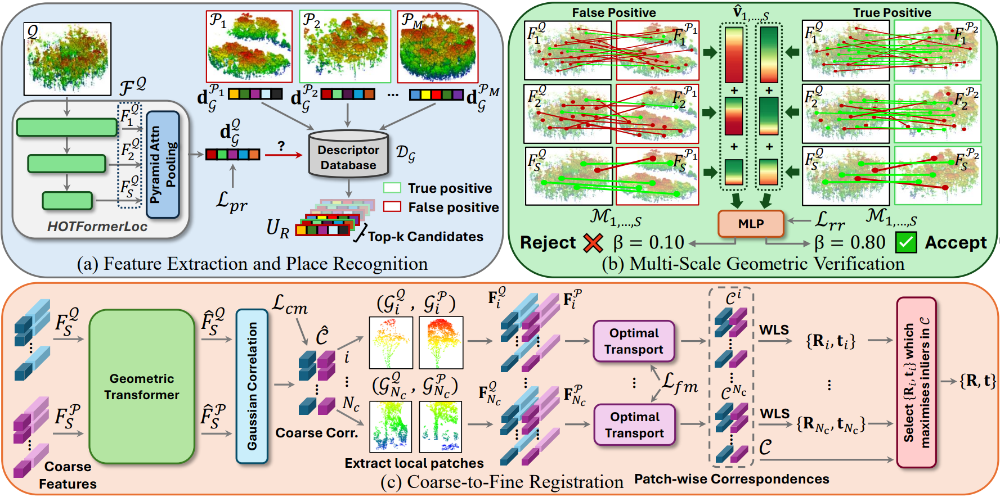
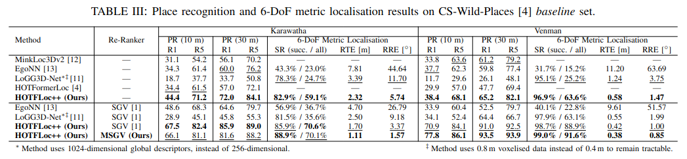
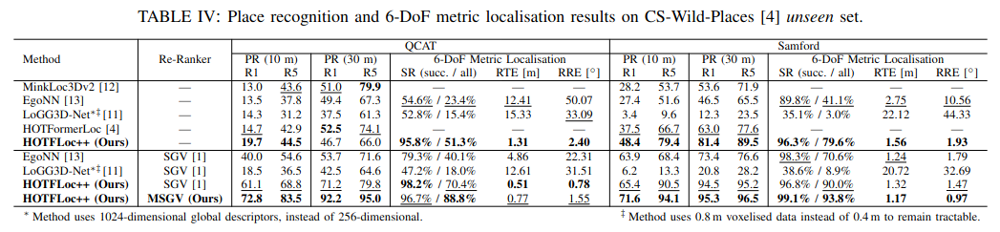

# HOTFLoc++: End-to-End Hierarchical LiDAR Place Recognition, Re-Ranking, and 6-DoF Metric Localisation in Forests

### What's new ###
* [2026-04-06] Training and evaluation code for HOTFLoc++ released, with added support for re-ranking and 6-DoF metric localisation.
* [2025-03-26] Training and evaluation code for [HOTFormerLoc](https://github.com/csiro-robotics/HOTFormerLoc) released. [CS-Wild-Places](https://data.csiro.au/collection/csiro:64896) dataset released.

## Description
This is the official repository for the paper:

**HOTFLoc++: End-to-End Hierarchical LiDAR Place Recognition, Re-Ranking, and 6-DoF Metric Localisation in Forests**, RA-L 2026 by *Ethan Griffiths, Maryam Haghighat, Simon Denman, Clinton Fookes, and Milad Ramezani*\
[[**arXiv**](https://arxiv.org/abs/2511.09170)] <!-- [[**Video**](https://youtube.com)] --> [[**CS-Wild-Places Dataset**](https://data.csiro.au/collection/csiro:64896)] [[**CS-Wild-Places README**](https://github.com/csiro-robotics/HOTFormerLoc/blob/main/media/CS_Wild_Places_README.pdf)]


*HOTFLoc++ Architecture*

We present **HOTFLoc++**, an end-to-end
hierarchical framework for LiDAR place recognition, re-ranking,
and 6-DoF metric localisation in forests. Leveraging an octree-
based transformer, our approach extracts features at multiple
granularities to increase robustness to clutter, self-similarity, and
viewpoint changes in challenging scenarios, including ground-to-
ground and ground-to-aerial in forest and urban environments.
We propose learnable multi-scale geometric verification to reduce
re-ranking failures due to degraded single-scale correspondences.
Our joint training protocol enforces multi-scale geometric consistency of the octree hierarchy via joint optimisation of place
recognition with re-ranking and localisation, improving place
recognition convergence. Our system achieves comparable or
lower localisation errors to baselines, with runtime improvements
of almost two orders of magnitude over RANSAC-based registration for dense point clouds. Experimental results on public
datasets show the superiority of our approach compared to state-
of-the-art methods, achieving an average Recall@1 of 90.7%
on CS-Wild-Places: an improvement of 29.6 percentage points
over baselines, while maintaining high performance on single-
source benchmarks with an average Recall@1 of 91.7% and
97.9% on Wild-Places and MulRan, respectively. Our method
achieves under 2 m and 5◦ error for 97.2% of 6-DoF registration attempts, with our multi-scale re-ranking module reducing
localisation errors by ∼2× on average.

<!--  -->
<div align="center">
	
</div>

*HOTFLoc++ achieves Pareto-optimality for place recognition (top) and metric localisation (bottom) on CS-Wild-Places. Filled symbols denote results after re-ranking.*

### Citation
If you find this work useful, please consider citing:
```bibtex
@article{HOTFLoc,
  title = {{{HOTFLoc}}++: {{End-to-End Hierarchical LiDAR Place Recognition}}, {{Re-Ranking}}, and 6-{{DoF Metric Localisation}} in {{Forests}}},
  author = {Griffiths, Ethan and Haghighat, Maryam and Denman, Simon and Fookes, Clinton and Ramezani, Milad},
  year = 2025,
  month = nov,
  journal = {arXiv preprint arXiv:2511.09170},
  eprint = {2511.09170},
  archiveprefix = {arXiv},
}
```

## Environment and Dependencies
Code was tested using Python 3.11 with PyTorch 2.1.1 and CUDA 12.1 on a Linux system. We use conda to manage dependencies (although we recommend [mamba](https://mamba.readthedocs.io/en/latest/installation/mamba-installation.html) for a much faster install).

### Installation
```bash
# Note: replace 'mamba' with 'conda' if using a vanilla conda install
mamba create -n hotfloc++ python=3.11 -c conda-forge -y
mamba activate hotfloc++
mamba install 'numpy<2.0' -c conda-forge -y
mamba install pytorch==2.1.1 torchvision==0.16.1 pytorch-cuda=12.1 -c pytorch -c nvidia -c conda-forge -y
pip install -r requirements.txt
pip install --no-build-isolation libs/dwconv

# For metric loc:
pip install --no-build-isolation -e libs/geotransformer/

# NOTE: MinkowskiEngine can be optionally installed, but is only required for evaluating Minkowski-based models (EgoNN, MinkLoc3Dv2). See https://github.com/NVIDIA/MinkowskiEngine for installation instructions.
```

Modify the `PYTHONPATH` environment variable to include the absolute path to the repository root folder (ensure this variable is set every time you open a new shell): 
```bash
export PYTHONPATH=$PYTHONPATH:<path/to/HOTFLoc++>
```

## Datasets

### Wild-Places
We train on the Wild-Places dataset introduced in *Wild-Places: A Large-Scale Dataset for Lidar Place Recognition in Unstructured Natural Environments* ([link](https://arxiv.org/pdf/2211.12732)).

Download the dataset [here](https://doi.org/10.25919/jm05-g895), and place or symlink the downloaded folder in `data/wild_places` (this should point to the top-level directory, with the `data/` and `metadata/` subdirectories).

**IMPORTANT**: we use an older version of the Wild-Places dataset. When prompted to "Do you want to view the most recent version of this item?", please click "No" to ensure you download the correct version.

Run the following to fix the broken timestamps in the poses files:
```bash
cd datasets/WildPlaces
python fix_broken_timestamps.py \
	--root '../../data/wild_places/data/' \
	--csv_filename 'poses.csv' \
	--csv_savename 'poses_fixed.csv' \
	--cloud_folder 'Clouds'

python fix_broken_timestamps.py \
	--root '../../data/wild_places/data/' \
	--csv_filename 'poses_aligned.csv' \
	--csv_savename 'poses_aligned_fixed.csv' \
	--cloud_folder 'Clouds_downsampled'
```

Before network training or evaluation, run the below code to generate pickles with positive and negative point clouds for each anchor point cloud:
```bash
cd datasets/WildPlaces
python generate_training_tuples.py \
	--root '../../data/wild_places/data/' 

python generate_test_sets.py \
	--root '../../data/wild_places/data/'
```

### CS-Wild-Places
We train on our novel CS-Wild-Places dataset, introduced in further detail in the [HOTFormerLoc paper](https://arxiv.org/abs/2503.08140). CS-Wild-Places is built upon the ground traversals introduced by Wild-Places, so it is required to download the Wild-Places dataset alongside our data following the instructions in the above section (generating train/test pickles for Wild-Places is not required for CS-Wild-Places, so this step can be skipped). Note that the full Wild-Places dataset must be downloaded as our post-processing utilises the full resolution submaps.


*CS-Wild-Places Dataset for Ground-to-Aerial LPR in Forest Environments*

Download our dataset from [CSIRO's data access portal](https://data.csiro.au/collection/csiro:64896), and place or symlink the data in `data/CS-Wild-Places` (this should point to the top-level directory, with the `data/` and `metadata/` subdirectories). Note that our experiments only require the post-processed submaps (folder `postproc_voxel_0.40m_rmground`), so you can ignore the raw submaps if space is an issue. Check the [README](./media/CS_Wild_Places_README.pdf) for further information and installation instructions for CS-Wild-Places.

Assuming you have followed the above instructions to setup Wild-Places, you can use the below command to post-process the Wild-Places ground submaps into the format required for CS-Wild-Places (set num_workers to a sensible number for your system). Note that this may take several hours depending on your CPU:
```bash
cd datasets/CSWildPlaces
python postprocess_wildplaces_ground.py \
	--root '../../data/wild_places/data/' \
	--cswildplaces_save_dir '../../data/CS-Wild-Places/data/CS-Wild-Places/postproc_voxel_0.40m_rmground' \
	--remove_ground \
	--downsample \
	--downsample_type 'voxel' \
	--voxel_size 0.4 \
	--num_workers XX \
	--verbose
```
Note that this script will generate the submaps used for the results reported in the paper, i.e. voxel downsampled, with ground points removed.

Before network training or evaluation, run the below code to generate pickles with positive and negative point clouds for each anchor point cloud:

```bash
cd datasets/CSWildPlaces
python generate_train_test_tuples_6dof.py \
	--root '../../data/CS-Wild-Places/data/CS-Wild-Places/postproc_voxel_0.40m_rmground/' \
	--eval_thresh '30' \
	--pos_thresh '15' \
	--neg_thresh '50' \
	--buffer_thresh '30' \
    --ignore_positives_poses
```
Note that training and evaluation pickles are saved to the directory specified in `--root` by default. 

### MulRan
We train on the MulRan dataset introduced in *MulRan: Multimodal Range Dataset for Urban Place Recognition* ([link](https://ieeexplore.ieee.org/document/9197298)).

Download the dataset [here](https://sites.google.com/view/mulran-pr/download), and place or symlink the data in `data/MulRan`. Note we only use DCC 01/02, Sejong 01/02, and Riverside 01/02 in our experiments.

Run the below commands to create the MulRan training and evaluation pickles:

```bash
cd datasets/mulran
python generate_training_tuples.py --dataset_root '../../data/MulRan/Sejong'
python generate_evaluation_sets_combined_seqs.py --dataset_root '../../data/MulRan/Sejong' --sequence 'Sejong'
python generate_evaluation_sets_combined_seqs.py --dataset_root '../../data/MulRan/DCC' --sequence 'DCC'
python generate_evaluation_sets_combined_seqs.py --dataset_root '../../data/MulRan/Riverside' --sequence 'Riverside'
```

## Training
To train **HOTFLoc++**, download the datasets and generate training pickles as described above for any dataset you wish to train on. 
The configuration files for each dataset can be found in `config/`. 
Set the `dataset_folder` parameter to the dataset root folder (only necessary if you have issues with the default relative path).
If running out of GPU memory, decrease `batch_split_size` and `val_batch_size` parameter value (and possibly `local_batch_size` for stage 2 training). If running out of RAM or shared memory (shm), you may need to decrease the `batch_size` parameter or try reducing `num_workers` to 1, but note that a smaller batch size may slightly reduce performance. We use wandb for logging by default, but this can be disabled in the config.

We use a two-stage training protocol, where stage 1 initialises the place recognition backbone, and stage 2 fine-tunes the metric localisation and learnable re-ranking heads. To train stage 1, run:

```bash
cd training
# CS-Wild-Places
python train.py --config ../config/config_hotfloc++_cs-wild-places_stage1.txt --model_config ../models/cfg_files/hotfloc++_cs-wild-places_stage1_cfg.txt
# Wild-Places
python train.py --config ../config/config_hotfloc++_wild-places_stage1.txt --model_config ../models/cfg_files/hotfloc++_wild-places_stage1_cfg.txt
# MulRan
python train.py --config ../config/config_hotfloc++_mulran_stage1.txt --model_config ../models/cfg_files/hotfloc++_mulran_stage1_cfg.txt
# For the 4-stage version of HOTFLoc++:
python train.py --config ../config/config_hotfloc++_mulran_stage1.txt --model_config ../models/cfg_files/hotfloc++_4lvl_mulran_stage1_cfg.txt
```

To subsequently train stage 2, run:
```bash
# CS-Wild-Places
python train.py --config ../config/config_hotfloc++_cs-wild-places_stage2.txt --model_config ../models/cfg_files/hotfloc++_cs-wild-places_stage2_cfg.txt --finetune_from ../weights/<path-to-stage1-ckpt>
# Wild-Places
python train.py --config ../config/config_hotfloc++_wild-places_stage2.txt --model_config ../models/cfg_files/hotfloc++_wild-places_stage2_cfg.txt --finetune_from ../weights/<path-to-stage1-ckpt>
# MulRan
python train.py --config ../config/config_hotfloc++_mulran_stage2.txt --model_config ../models/cfg_files/hotfloc++_mulran_stage2_cfg.txt --finetune_from ../weights/<path-to-stage1-ckpt>
# For the 4-stage version of HOTFLoc++:
python train.py --config ../config/config_hotfloc++_mulran_stage2.txt --model_config ../models/cfg_files/hotfloc++_4lvl_mulran_stage2_cfg.txt --finetune_from ../weights/<path-to-stage1-ckpt>
```
**Note** that for most models, we initialise stage 2 training with checkpoints from **epoch 60** of stage 1 training, but you can use the latest weights if desired. We also provide pre-trained weights for both stage 1 and stage 2, which can be downloaded in the following section.

If training on a SLURM cluster, we provide the `submitit_train_job_single_node.py` script to automate training job submission, with support for automatic checkpointing and resubmission on job timeout. Make sure to set job parameters appropriately for your cluster.

### Pre-trained Weights

Pre-trained weights for HOTFLoc++ and other experiments can be downloaded and placed in the `weights` directory. You can download them individually below (note you may need to rename the downloaded file to match the names listed below).
| Model        | Dataset         | Weights Download                                                                                                                                                         |
|--------------|-----------------|--------------------------------------------------------------------------------------------------------------------------------------------------------------------------|
| HOTFLoc++ | CS-Wild-Places (0.4m voxels) | [hotfloc++_cs-wild-places_stage1_e60.ckpt](https://drive.google.com/file/d/1O6WGp2QAN91MbXnV6jAfCGemj4zinY7v/view?usp=sharing) / [hotfloc++_cs-wild-places_stage2_e60.ckpt](https://drive.google.com/file/d/1KpTGRK3lalKAHJeUFdFB7UhDdvAdAMIi/view?usp=sharing) |
| HOTFLoc++ | Wild-Places     | [hotfloc++_wild-places_stage1_e60.ckpt](https://drive.google.com/file/d/1jjEA5Eef48-ekPz-LO6M-_SrXTDjCgex/view?usp=sharing) / [hotfloc++_wild-places_stage2_e60.ckpt](https://drive.google.com/file/d/1_KfgWJara1kkBs7Pioci3r9QNuXymgGq/view?usp=sharing)       |
| HOTFLoc++ | MulRan     | [hotfloc++_mulran_stage1_e60.ckpt](https://drive.google.com/file/d/1schcUtcoZ7UWNK0wYdJeB600eLdgF-Gl/view?usp=drive_link) / [hotfloc++_mulran_stage2_e60.ckpt](https://drive.google.com/file/d/1_PopwDxs6EOmkfT2Xzl4DTp-_ZYCePXQ/view?usp=sharing)       |
| HOTFLoc++ (4 Levels) | MulRan     | [hotfloc++_4lvl_mulran_stage1_e70.ckpt](https://drive.google.com/file/d/1fW3lWEf6Gr3boc9bt1CTBAU8gT4B5ejz/view?usp=sharing) / [hotfloc++_4lvl_mulran_stage2_e60.ckpt](https://drive.google.com/file/d/1ORA_QreeSGH54FFO0F4kcQ5sa6KL4kaq/view?usp=sharing)       |
| HOTFormerLoc | CS-Wild-Places (0.4m voxels) | [hotformerloc_cs-wild-places_voxel0.4m_e70.ckpt](https://drive.google.com/file/d/1BxkaHa-sGET1F9-BNDSEhMABtjQKlyRS/view?usp=sharing)                 |
| HOTFormerLoc | CS-Wild-Places (0.8m voxels) | [hotformerloc_cs-wild-places_voxel0.8m.pth](https://www.dropbox.com/scl/fi/bcgcmbyic591f3bviib64/hotformerloc_cs-wild-places.pth?rlkey=vrw0seq6nfbsihijbhqatll2u&st=d7enawjw&dl=0)                 |
| EgoNN  | CS-Wild-Places (0.4m voxels) | [egonn_cs-wild-places_e120.ckpt](https://drive.google.com/file/d/1Dwg2eu0Bp_tokaMZziUslAMqbY8gtbFG/view?usp=sharing)   |
| EgoNN  | Wild-Places | [egonn_wild-places_e160.ckpt](https://drive.google.com/file/d/1fAUHXuvJwpoJ0drGnPzNkzLDpJ1sXgJS/view?usp=sharing)   |
| EgoNN  | MulRan | [egonn_mulran_e160.ckpt](https://drive.google.com/file/d/1D96kMWikF0Egm6Mrc8UI_oK5MjeNV4Sf/view?usp=sharing)   |
| LoGG3D-Net (1024 dim)   | CS-Wild-Places (0.8m voxels) | [logg3dnet_cs-wild-places.pth](https://www.dropbox.com/scl/fi/51se5akdyg35xy2dsrosj/logg3dnet_cs-wild-places.pth?rlkey=4nvvp8gw656wdbj3081jzcn0i&st=yi7hvp1j&dl=0)       |
| LoGG3D-Net (1024 dim)   | Wild-Places | [logg3dnet_wild-places.pth](https://www.dropbox.com/s/h1ic00tvfnstvfm/LoGG3D-Net.pth?dl=0)   |
| LoGG3D-Net (1024 dim)   | MulRan | [logg3dnet_mulran.pth](https://www.dropbox.com/scl/fo/in698japw8hzgymg1y1u1/AHUm0blFTs3BF4rs2WAipsY/logg3d.pth?rlkey=rcofv0ouvf1gc22mj8r99dajq&dl=0)   |
| MinkLoc3Dv2  | CS-Wild-Places (0.4m voxels) | [minkloc3dv2_cs-wild-places_voxel0.4m.ckpt](https://drive.google.com/file/d/19SRrrfryRRIq8B35xOgiV0QvbWvloJvm/view?usp=sharing)   |
| MinkLoc3Dv2  | CS-Wild-Places (0.8m voxels) | [minkloc3dv2_cs-wild-places_voxel0.8m.pth](https://www.dropbox.com/scl/fi/2w4l8gv7qbmp0lh4eztsf/minkloc3dv2_cs-wild-places.pth?rlkey=udxvtkr6yfgdnyizra4gmw0qa&st=p0evrh61&dl=0)   |
| MinkLoc3Dv2  | Wild-Places  | [minkloc3dv2_wild-places.pth](https://www.dropbox.com/s/8ijq9h99m1snzxn/MinkLoc3Dv2.pth?dl=0)   |

If you wish to run any experiments with HOTFormerLoc (which can be done from this repo), please download the appropriate weights from the [HOTFormerLoc repo](https://github.com/csiro-robotics/HOTFormerLoc?tab=readme-ov-file#pre-trained-weights). Note that the CS-Wild-Places experiments in HOTFormerLoc used submaps downsampled with 0.8m voxels, rather than the 0.4m voxels used in HOTFLoc++.

## Evaluation

To evaluate the pretrained models run the following commands:

```bash
cd eval
# CS-Wild-Places
python evaluate_metric_loc_splits_rerank.py --config ../config/config_hotfloc++_cs-wild-places_stage2.txt --model_config ../models/cfg_files/hotfloc++_cs-wild-places_stage2_cfg.txt --weights ../weights/hotfloc++_cs-wild-places_stage2_e60.ckpt
# Wild-Places
python evaluate_metric_loc_splits_rerank.py --config ../config/config_hotfloc++_wild-places_stage2.txt --model_config ../models/cfg_files/hotfloc++_wild-places_stage2_cfg.txt --weights ../weights/hotfloc++_wild-places_stage2_e60.ckpt
# MulRan
python evaluate_metric_loc_splits_rerank.py --config ../config/config_hotfloc++_mulran_stage2.txt --model_config ../models/cfg_files/hotfloc++_mulran_stage2_cfg.txt --weights ../weights/hotfloc++_mulran_stage2_e60.ckpt
# For the 4-stage version of HOTFLoc++:
python evaluate_metric_loc_splits_rerank.py --config ../config/config_hotfloc++_mulran_stage2.txt --model_config ../models/cfg_files/hotfloc++_4lvl_mulran_stage2_cfg.txt --weights ../weights/hotfloc++_4lvl_mulran_stage2_e60.ckpt
```
By default, this will run evaluation for metric localisation under the 'success' protocol, where only successful retrievals are used for metric localisation evaluation. To run evaluation under the 'all' protocol, where both successes and failures are used, provide the `--local_max_eval_threshold 10000000000` flag to `evaluate_metric_loc_splits_rerank.py`.

MinkLoc-based models can also be evaluated within this repo (provided you have installed MinkowskiEngine, see [Installation](#installation)). For example:
```bash
# EgoNN
python evaluate_metric_loc_splits_rerank.py --config ../config/other_models/config_egonn_cs-wild-places.txt --model_config ../models/cfg_files/egonn.txt --weights ../weights/egonn_cs-wild-places_e120.ckpt
python evaluate_metric_loc_splits_rerank.py --config ../config/other_models/config_egonn_wild-places.txt --model_config ../models/cfg_files/egonn.txt --weights ../weights/egonn_wild-places_e160.ckpt
python evaluate_metric_loc_splits_rerank.py --config ../config/other_models/config_egonn_mulran.txt --model_config ../models/cfg_files/egonn.txt --weights ../weights/egonn_mulran_e160.ckpt
# MinkLoc3Dv2
python pnv_evaluate_splits.py --config ../config/other_models/config_minkloc3dv2_cs-wild-places.txt --model_config ../models/cfg_files/minkloc3dv2.txt --weights ../weights/minkloc3dv2_cs-wild-places_voxel0.4m.ckpt
python pnv_evaluate_splits.py --config ../config/hotformerloc_cfgs/config_minkloc3dv2_cs-wild-places.txt --model_config ../models/cfg_files/minkloc3dv2.txt --weights ../weights/minkloc3dv2_cs-wild-places_voxel0.8m.pth
python pnv_evaluate_splits.py --config ../config/other_models/config_minkloc3dv2_wild-places.txt --model_config ../models/cfg_files/minkloc3dv2_wild-places.txt --weights ../weights/minkloc3dv2_wild-places.pth
```

For [HOTFormerLoc](https://github.com/csiro-robotics/HOTFormerLoc) experiments:
```bash
# To evaluate HOTFormerLoc trained on CS-Wild-Places (0.4m voxels)
python pnv_evaluate_splits.py --config ../config/hotformerloc_cfgs/config_cs-wild-places_voxel0.4m.txt --model_config ../models/hotformerloc_cs-wild-places_cfg.txt --weights ../weights/hotformerloc_cs-wild-places_voxel0.4m_e70.ckpt
# To evaluate HOTFormerLoc trained on CS-Wild-Places (0.8m voxels)
python pnv_evaluate_splits.py --config ../config/hotformerloc_cfgs/config_cs-wild-places.txt --model_config ../models/hotformerloc_cs-wild-places_cfg.txt --weights ../weights/hotformerloc_cs-wild-places_voxel0.8m.pth
# To evaluate HOTFormerLoc trained on Wild-Places
python pnv_evaluate_splits.py --config ../config/hotformerloc_cfgs/config_wild-places.txt --model_config ../models/hotformerloc_wild-places_cfg.txt --weights ../weights/hotformerloc_wild-places.pth
# To evaluate HOTFormerLoc trained on CS-Campus3D
python pnv_evaluate_splits.py --config ../config/hotformerloc_cfgs/config_cs-campus3d.txt --model_config ../models/hotformerloc_cs-campus3d_cfg.txt --weights ../weights/hotformerloc_cs-campus3d.pth
# To evaluate HOTFormerLoc trained on Oxford RobotCar
python pnv_evaluate_splits.py --config ../config/hotformerloc_cfgs/config_oxford.txt --model_config ../models/hotformerloc_oxford_cfg.txt --weights ../weights/hotformerloc_oxford.pth
```

For LoGG3D-Net experiments, we provide an altered version of the LoGG3D-Net repo capable of running on Wild-Places and CS-Wild-Places at [this link](https://drive.google.com/file/d/1tIf3-X51tLmCgn5fuUF1lCvYPWTF7syy/view?usp=sharing). Please follow the included README for instructions on re-producing our experimental results.

Below are the results for all evaluated models on CS-Wild-Places:


*Comparison of SOTA on CS-Wild-Places Baseline evaluation set.*


*Comparison of SOTA on CS-Wild-Places Unseen evaluation set.*

See the paper for full results and comparison with SOTA on all datasets.

## Acknowledgements

Special thanks to the authors of [MinkLoc3Dv2](https://github.com/jac99/MinkLoc3Dv2), [OctFormer](https://github.com/octree-nn/octformer), [SpectralGV](https://github.com/csiro-robotics/SpectralGV), and [GeoTransformer](https://github.com/qinzheng93/GeoTransformer) for their excellent code, which formed the foundation of this codebase.
